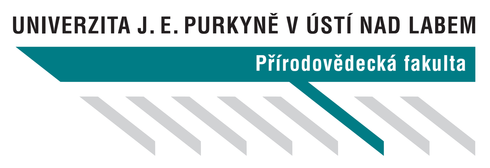

# UJEP notes

#### Martin Kopecký | **Aplikovaná informatika**

---
### **Rozcestí** (1 semestr)

* [Algoritmizace a programování](./1-semestr/algoritmizace.pdf)
* [Angličtina](./1-semestr/anglictina.pdf)
* [Architekruta počítaců](./1-semestr/architekturapc.pdf)
* [Teoretické základy informatiky](./1-semestr/informatika.pdf)
* Matematika 1 -  **([teorie](./1-semestr/matematika-ter.pdf) | [cvičení](./1-semestr//matematika-cv.pdf))**
* [Základy počítatových sítí a protokolů](./1-semestr/pocitacovesite.pdf)
* [Podniková ekonomika](./1-semestr/podnikovaekonomika.pdf)
* [Repetitorium matematiky](./1-semestr/repetitoriummat.pdf)
* [Základy elektroniky](./1-semestr/zakladyelektroniky.pdf)
